# Guc Hub

An unofficial, student-built companion app for German University in Cairo (GUC)
students — mail + portal (schedule, grades, CMS, and more) in one app, for iOS and
Android from one codebase.

> **Project status: finished as a portfolio project.** GUC has since released its
> own official app, so Guc Hub will not be released. The app runs end to end on
> **built-in demo data** (tap **Try demo**). It has **never been run against
> GUC's real servers**, and it is **not affiliated with GUC**. Do not enter real
> GUC credentials into a build of this app.

By design there is **no Guc Hub backend**: the app runs entirely on the phone and would talk
directly to GUC's own servers with the student's own credentials, which never leave the
device except to GUC's own hosts. See [docs/ARCHITECTURE.md](docs/ARCHITECTURE.md).

## What is real and what is mocked

| Area                                                                                                  | State                                                                                                                                                      |
| ----------------------------------------------------------------------------------------------------- | ---------------------------------------------------------------------------------------------------------------------------------------------------------- |
| Auth: login, secure credential storage, silent re-login, biometric unlock, demo mode                  | Built. Only the mock strategy has been exercised end to end                                                                                                |
| Schedule, Grades, CMS, Exams, Attendance, Staff, Transcript, Evaluations                              | Built on demo data, with unit tests. No live source or parser (nothing was ever captured from the real portal)                                             |
| Settings (theme, sign out, unofficial notice)                                                         | Built                                                                                                                                                      |
| Glide (on-device tap-to-flap game, local best score)                                                  | Built                                                                                                                                                      |
| Mail (list, read, search, compose, attachments, swipe-delete, safe HTML)                              | Built on demo data with ~170 logic tests and driven on an Android emulator (see [the device test report](docs/DEVICE_TEST_REPORT.md)). No live mail server |
| Real NTLM login (`modules/guc-ntlm`, iOS `URLSession` and Android OkHttp) and an Android trust anchor | Written and unit-tested. Never verified against GUC's real servers                                                                                         |
| Push notifications, leaderboard backend, home-screen widgets                                          | Not built. See [docs/ROADMAP.md](docs/ROADMAP.md)                                                                                                          |

## Screenshots

Android emulator, demo mode. Everything shown is built-in fake data, not a real
student's. Light on the first row of each pair, dark on the second. More, including
the demo GIF, in [docs/screenshots](docs/screenshots/README.md); what was tested
is in [docs/DEVICE_TEST_REPORT.md](docs/DEVICE_TEST_REPORT.md).

<table>
  <tr><td align="center">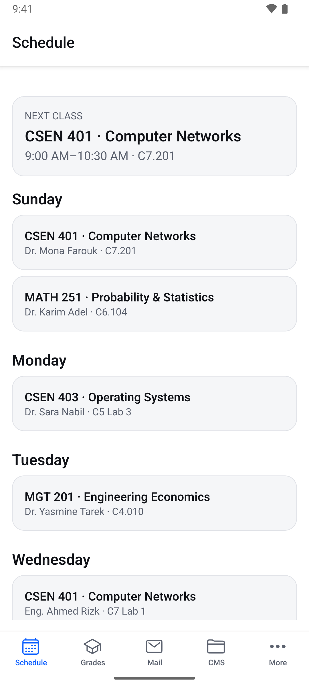<br><sub>Schedule</sub></td><td align="center">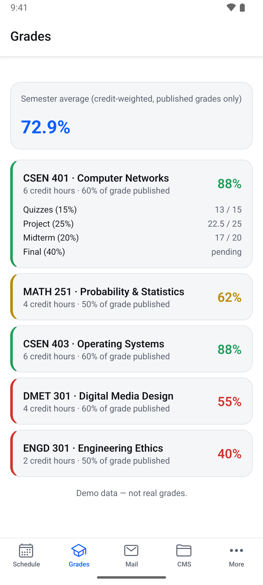<br><sub>Grades</sub></td><td align="center">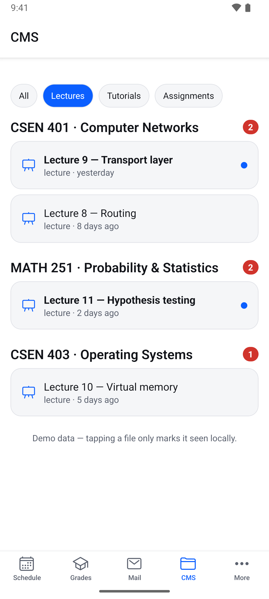<br><sub>CMS</sub></td><td align="center">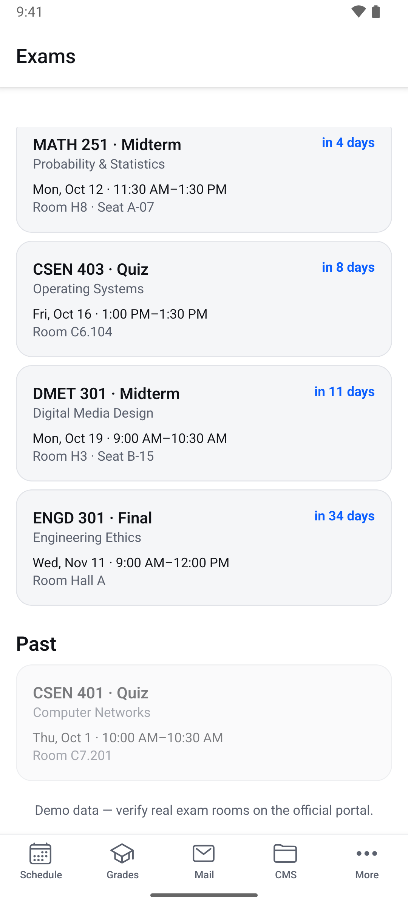<br><sub>Exams</sub></td></tr>
  <tr><td align="center">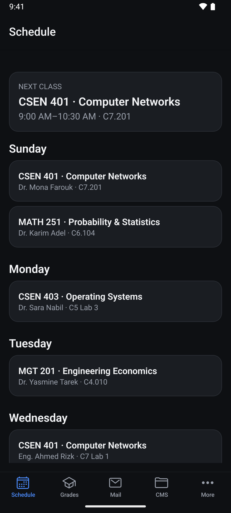<br><sub>Schedule</sub></td><td align="center">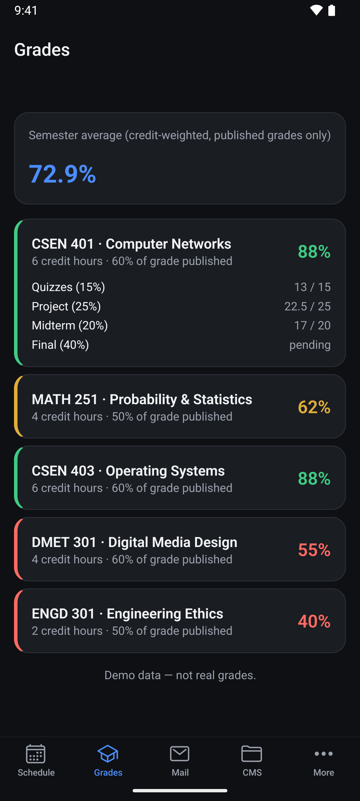<br><sub>Grades</sub></td><td align="center">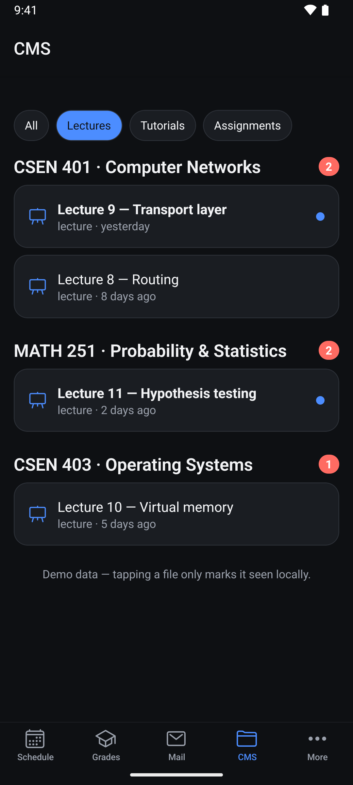<br><sub>CMS</sub></td><td align="center">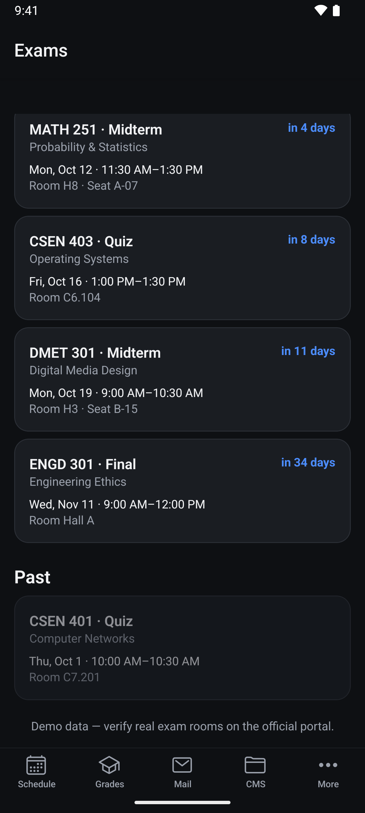<br><sub>Exams</sub></td></tr>
  <tr><td align="center">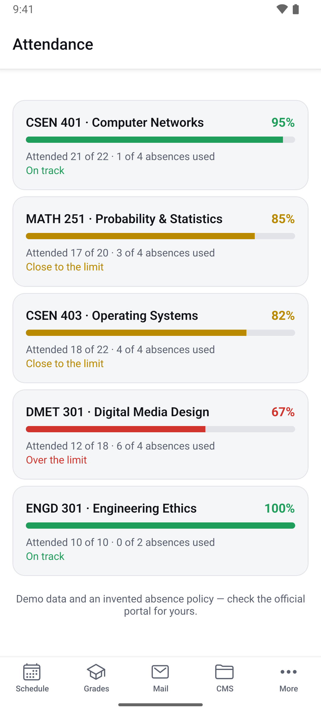<br><sub>Attendance</sub></td><td align="center">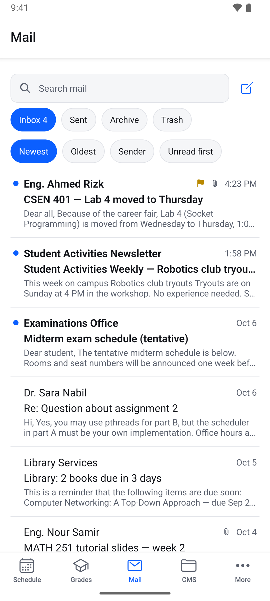<br><sub>Mail</sub></td><td align="center">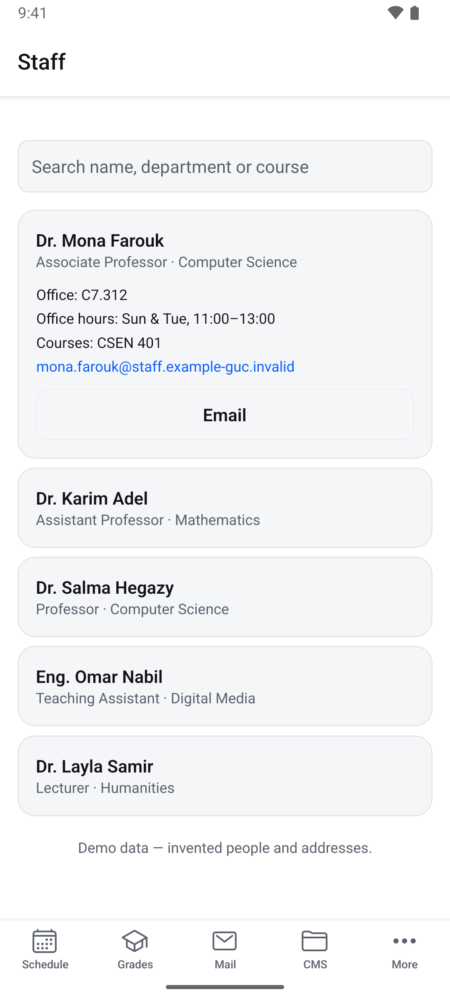<br><sub>Staff</sub></td><td align="center">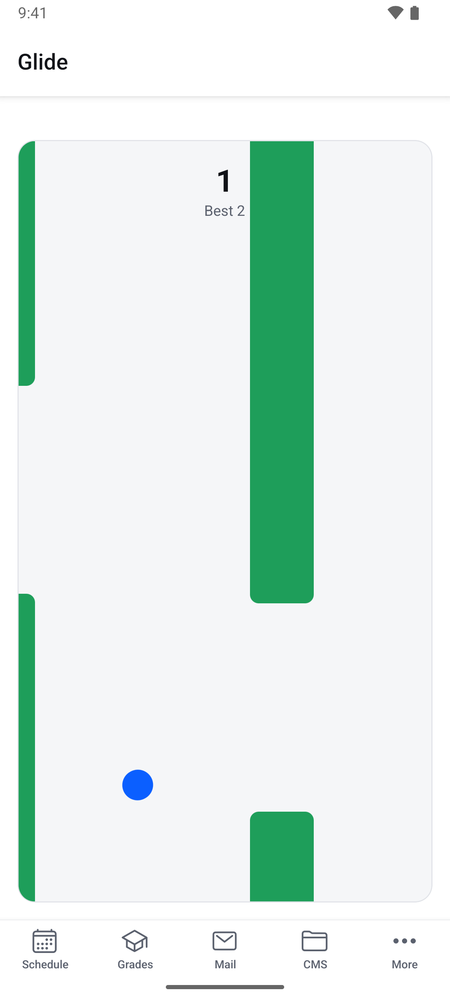<br><sub>Glide</sub></td></tr>
  <tr><td align="center">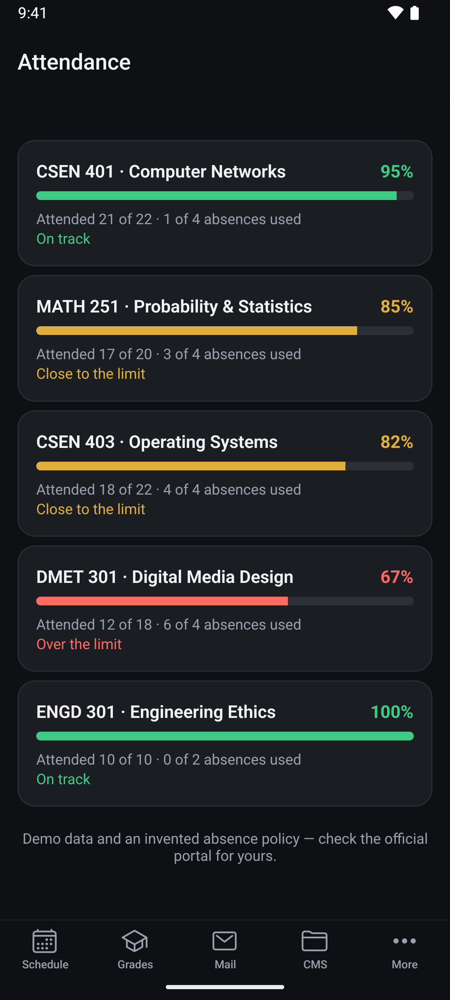<br><sub>Attendance</sub></td><td align="center">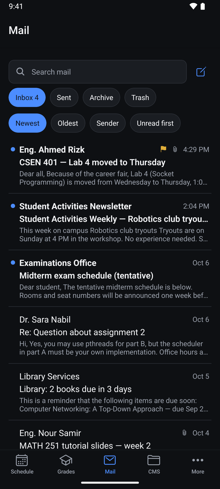<br><sub>Mail</sub></td><td align="center">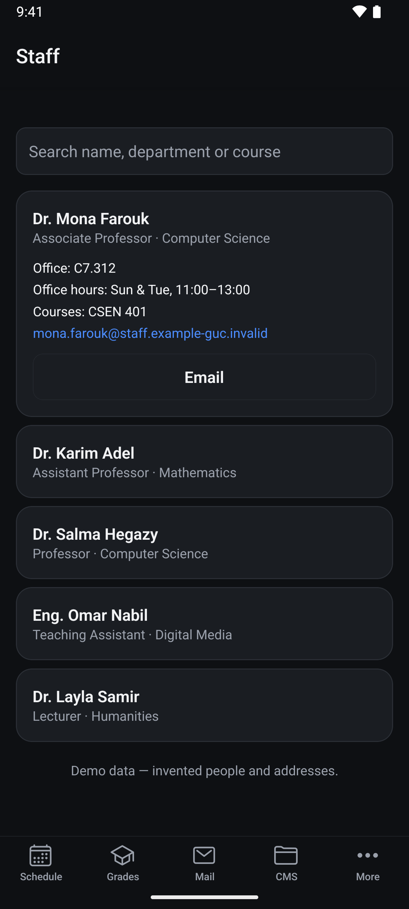<br><sub>Staff</sub></td><td align="center">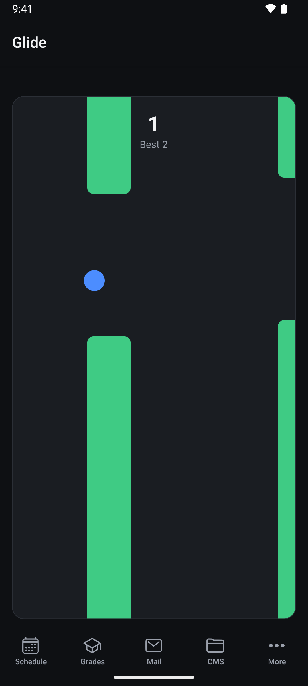<br><sub>Glide</sub></td></tr>
</table>

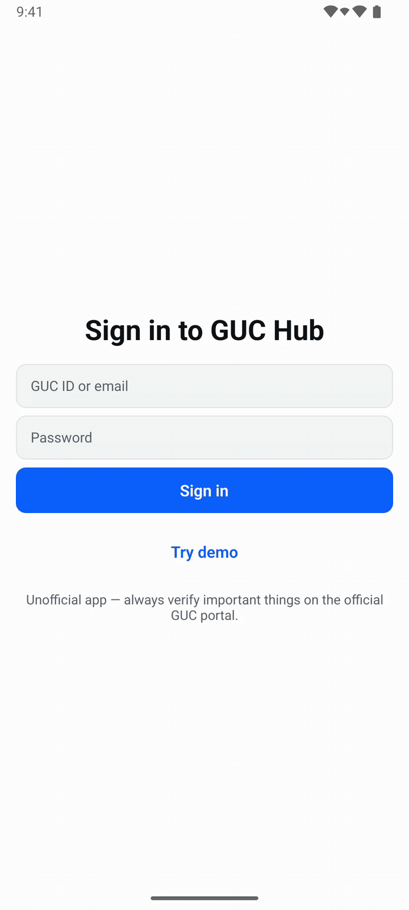

## Engineering highlights

- **No backend by design.** The phone talks directly to the university's own hosts
  and credentials never leave the device ([ADR S-002](docs/adr/S-002-credentials-and-session.md)).
- **Feature-folder architecture with codegen.** Each feature is a manifest, zod
  schema, source (mock or live), store and screens. `tools/gen-registry.js`
  generates the tab bar, More menu, i18n bundle, allowed-host list and SQLite
  migrations, and an ESLint boundaries rule stops features importing each other.
- **Typed portal errors** (`PortalError`) drive one uniform error UI, including an
  "Open original page" fallback when a parser breaks.
- **Security-minded plumbing:** credential redaction in logs, an https-only host
  allowlist, and a mail HTML/CSS sanitizer and navigation policy tested against a
  hostile fixture.
- **A native NTLM module** for iOS and Android, plus a documented investigation of
  how the portal authenticates ([ADR A-001](docs/adr/A-001-portal-auth.md)).
- **Conflict-proofed two-person workflow:** track ownership, CODEOWNERS, a CI scope
  guard and a rehearsal script ([docs/PARALLEL_WORK.md](docs/PARALLEL_WORK.md)).
- Expo SDK 57, Expo Router, React Native 0.86 (new architecture), TypeScript strict,
  TanStack Query, Jest, Maestro.

## Lessons

- The authentication scheme was the real unknown, not the UI. Writing spikes and
  ADRs before code kept the guesswork out of the product code.
- Mock-first development let every screen be finished, tested and demoed without
  ever touching the real portal.
- Building on a university's private systems is a moving target, and the university
  eventually shipped its own app.

## Quickstart

Requires Node 20+ and pnpm (`corepack enable && corepack prepare pnpm@latest --activate`,
or `npm install -g pnpm`). This app uses **development builds**
(`expo-dev-client`), not Expo Go — native modules (secure storage, biometrics,
SQLite, background tasks) are required from day one, so the app needs to be
installed once per platform before `pnpm start` can load JS into it.

```bash
git clone https://github.com/youssef4laa/guc-hub.git && cd guc-hub
pnpm install
cp .env.example .env.local   # defaults already run the app in demo mode
```

### Android emulator

Requires Android Studio with an emulator (AVD) already created and bootable.

```bash
pnpm exec expo run:android
```

Builds the dev client with Gradle, installs it on whichever emulator/device `adb`
sees, and starts Metro. Subsequent runs: `pnpm start`, then press `a`.

### Physical Android phone

```bash
# Phone connected over USB with USB debugging enabled, or on the same Wi-Fi:
adb devices          # confirm the phone shows up
pnpm exec expo run:android --device
```

Or build a standalone APK in the cloud and install it without a cable:

```bash
npx eas-cli@latest build --profile development --platform android
# scan the QR code EAS prints, or open the build link on the phone, to install it
pnpm start            # then open the installed app and it connects to Metro
```

### iOS — via EAS (recommended; see "Known issue" below)

No Mac required to build. This produces a build for the **iOS Simulator**, no
Apple Developer account or code signing needed:

```bash
npx eas-cli@latest login          # once
npx eas-cli@latest build --profile development-simulator --platform ios
# when it finishes, drag the downloaded .app onto a booted Simulator, or:
npx eas-cli@latest build:run --profile development-simulator --platform ios --latest
pnpm start            # then open the installed app and it connects to Metro
```

For a **real iPhone** instead of the Simulator, you need a paid Apple Developer
account (for device registration/provisioning):

```bash
npx eas-cli@latest build --profile development --platform ios
# EAS walks you through registering the device the first time
```

### Known issue: local iOS builds (`expo run:ios`) are currently blocked

`expo-modules-jsi` (bundled with Expo SDK 57) declares `swift-tools-version: 6.2`
in its Swift Package Manager manifest, but Xcode 16.3 only ships Swift 6.1 —
`pod install` / `xcodebuild` fails with _"package 'apple' is using Swift tools
version 6.2.0 but the installed version is 6.1.0"_. This is a known upstream
issue: [expo/expo#50067](https://github.com/expo/expo/issues/50067). Until it's
resolved (or you have Xcode 16.4+ / a compatible newer Xcode installed), **build
iOS via EAS** (above) instead of `expo run:ios` on this machine. Android is
unaffected — `expo run:android` works locally today.

Once either platform's dev client is installed, tap **Try demo** on the login
screen — the whole app runs on realistic fake data, no GUC account required
(this is also how App/Play Store reviewers use it).

## Commands

```bash
pnpm start / ios / android / web
pnpm typecheck
pnpm lint          # pnpm lint:fix to auto-fix
pnpm test
pnpm e2e           # Maestro smoke flow, demo mode
pnpm gen:feature <name>     # scaffold a new feature from src/features/_template
pnpm gen:registry           # regenerate src/core/registry/registry.generated.ts
pnpm sanitize-fixture <path-to-captured.html>
```

## Docs

- [docs/ARCHITECTURE.md](docs/ARCHITECTURE.md) — how the pieces fit together
- [docs/CONTRIBUTING.md](docs/CONTRIBUTING.md) — track ownership, PR rules, definition of done
- [docs/DISCOVERY.md](docs/DISCOVERY.md) — research spikes on GUC's real portals (archival)
- [docs/LOCAL_HANDOFF.md](docs/LOCAL_HANDOFF.md) — the plan for finishing on a machine with an emulator
- [docs/DEVICE_CAPTURE.md](docs/DEVICE_CAPTURE.md) — emulator smoke-test and screenshot brief
- [docs/ROADMAP.md](docs/ROADMAP.md) — feature phases and what's genuinely out of scope
- [docs/adr/](docs/adr/) — why the stack, credential model, and feature conventions are what they are

## Authors

- Youssef Alaa — [@youssef4laa](https://github.com/youssef4laa)
- [@mokhalifa9](https://github.com/mokhalifa9)

## License

MIT — see [LICENSE](LICENSE). `modules/guc-ntlm` vendors Apache HttpClient NTLM
classes under the Apache License 2.0 (see its `NOTICE`).
