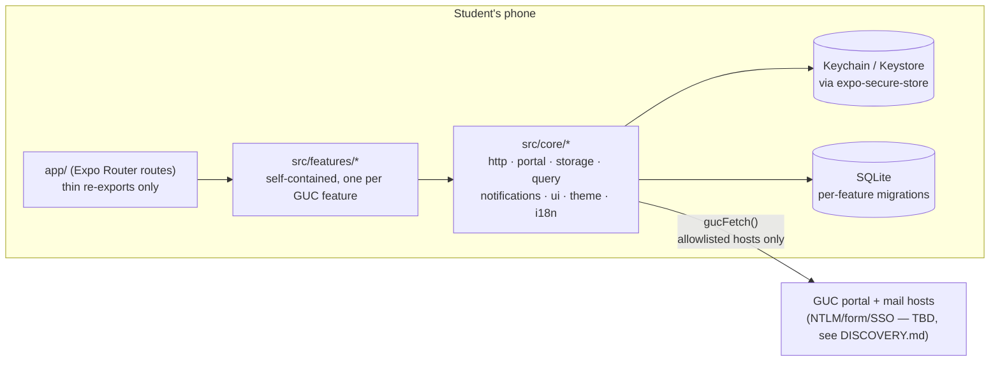

# Architecture

Guc Hub is a **client-side wrapper** around GUC's own portals. There is no backend:
the phone signs in with the student's real GUC credentials and talks directly to
GUC's servers. Everything in this document exists to make that safe (credentials
never leave the device except to GUC's own hosts) and to make it possible for two
developers to build features in parallel without touching each other's files.

## System shape



## The live/mock seam

Every content feature (schedule, grades, mail, ...) has the same shape:

```
src/features/<name>/
  manifest.ts   # { id, title, icon, order, showInTabBar, enabled, route }
  schema.ts     # zod schema — the feature's data shape, owned only here
  source.ts     # picks mock.ts or live.ts based on demo mode
  live.ts       # real fetch + parser.ts; throws NOT_IMPLEMENTED until a fixture exists
  mock.ts       # realistic fake data, always works
  parser.ts     # captured-HTML -> typed data; PARSE_FAILED on layout change, never a crash
  parser.test.ts
  store.ts      # TanStack Query hooks
  screens/, components/
  README.md     # owner, source app, blocking DISCOVERY spikes
```

`auth` and `settings` deviate slightly from this shape — see their READMEs and
ADR-003.

## Why a registry instead of a shared route table

Section "adding a feature" of docs/CONTRIBUTING.md: a new feature never means
editing a file another feature also edits. `tools/gen-registry.js` transpiles every
`manifest.ts` and writes the gitignored `src/core/registry/registry.generated.ts`;
the tab bar, the "More" menu, and the settings list are all _generated from that
data_, not hand-maintained lists. See ADR-003 for why this is a codegen script and
not `require.context` (Metro doesn't support it outside Expo Router's own internal
use).

## Error handling

Every portal-facing operation throws a typed `PortalError` (`AUTH_INVALID`,
`SESSION_EXPIRED`, `PORTAL_UNAVAILABLE`, `PARSE_FAILED`, `TRANSCRIPT_LOCKED`,
`NOT_IMPLEMENTED`, `OFFLINE`), and `core/ui/ErrorState.tsx` is the single place that
turns a code into UI. `PARSE_FAILED` always offers "Open original page" — a WebView
onto the real GUC page — so a broken parser degrades the feature, it never blocks
the student from their data.

## What's core vs what's a feature

- **`core/`** is cross-cutting infrastructure: the network client, the portal
  session/login machinery, storage, the design system, theming, i18n, notifications.
  It never imports from `src/features/*`.
- **`features/*`** are content. They may import `core/`, never each other (enforced
  by the `boundaries/dependencies` ESLint rule). If two features seem to need the
  same thing, that thing belongs in `core/`, not in one feature imported by another.

## Not in this foundation

- A real `LoginStrategy` (NTLM/form) — see docs/DISCOVERY.md Spike 1.
- Real live parsers for any feature except the stubs in `live.ts`/`parser.ts`.
- Push notifications (impossible without a backend — see docs/ROADMAP.md).
- The Flappy leaderboard backend (deliberately deferred, see docs/ROADMAP.md).
